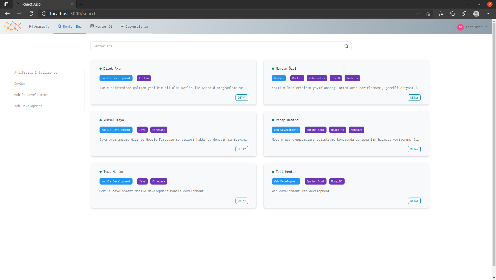
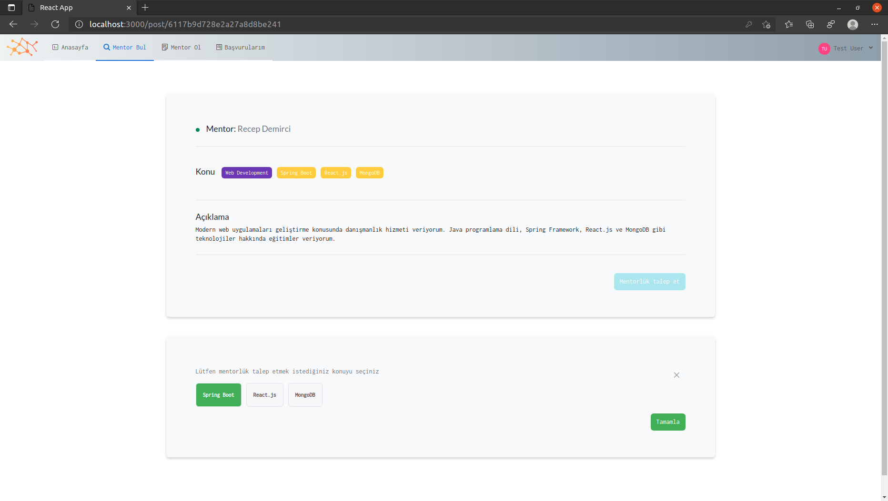
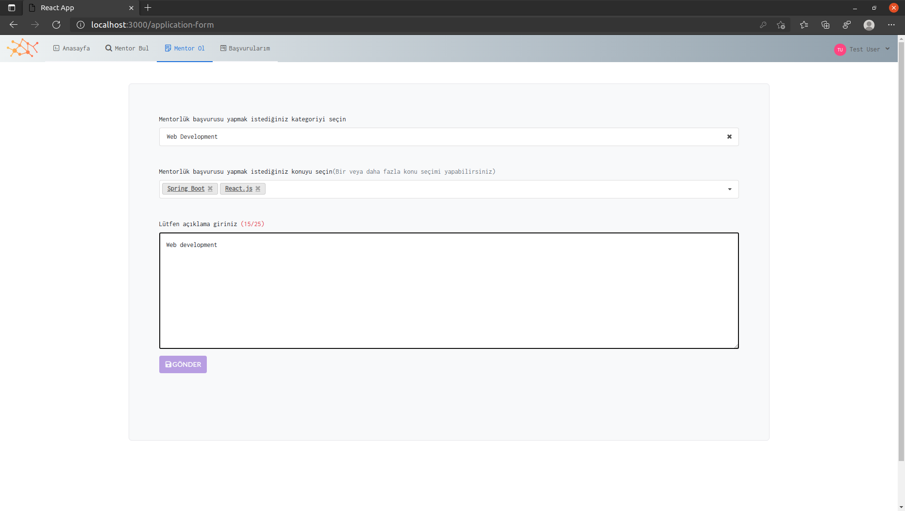
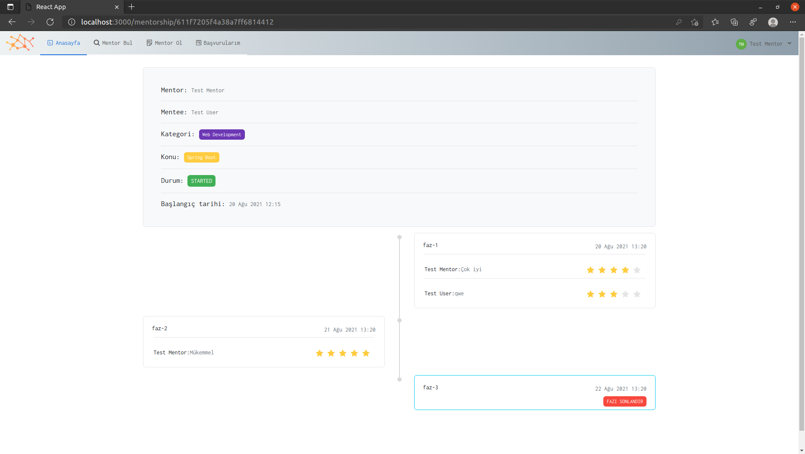
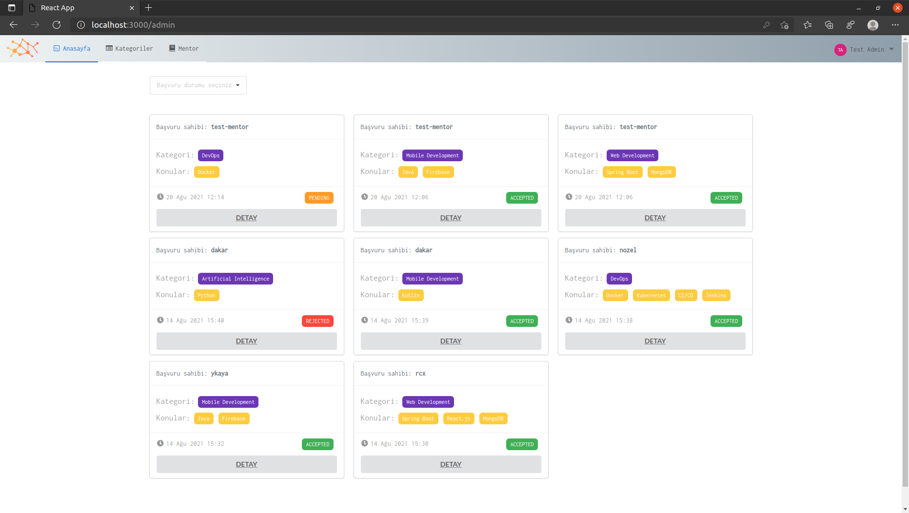
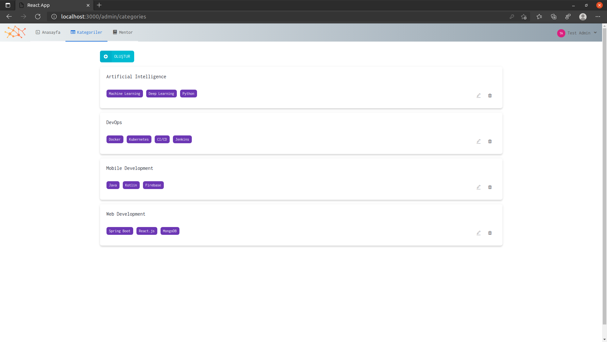
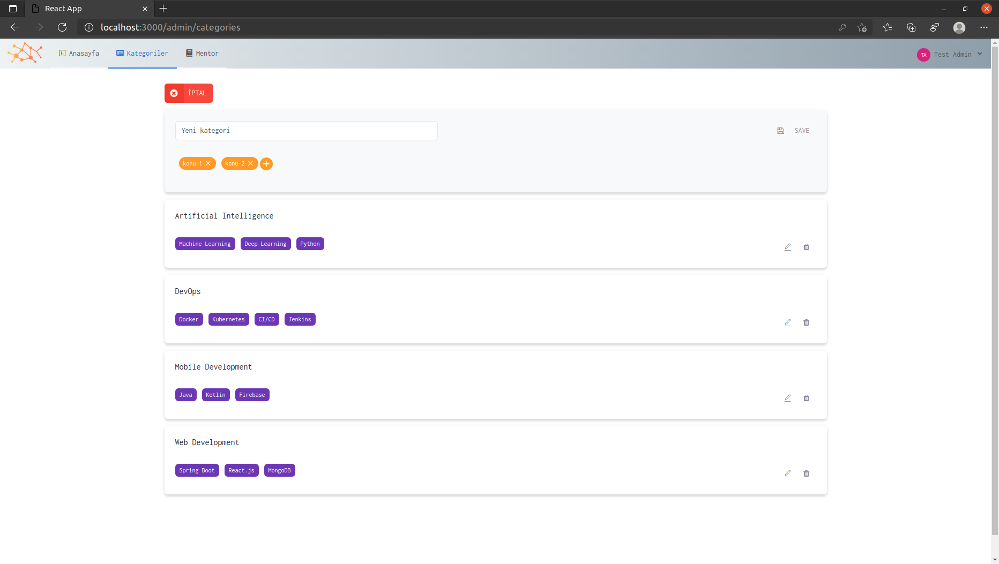
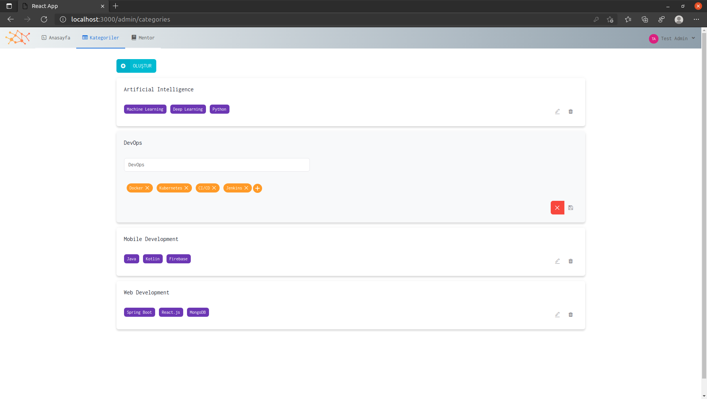

# spring-react-mongo-mentorship
This repository includes a web application that was developed for OBSS Java Summer Internship Program. The application serves online mentorship services for users.

